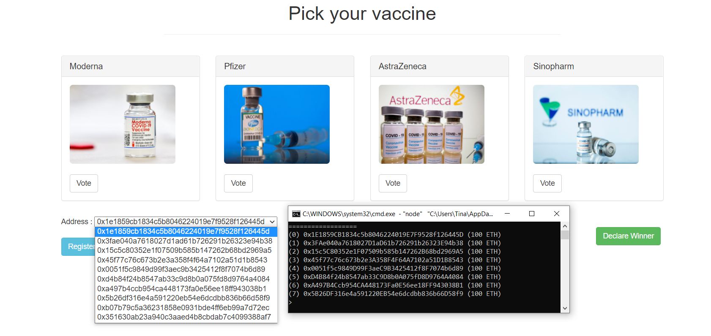
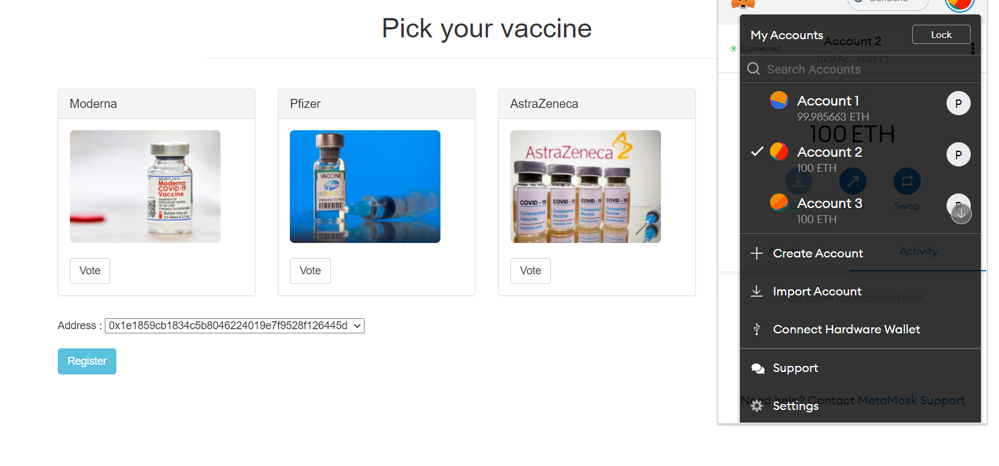
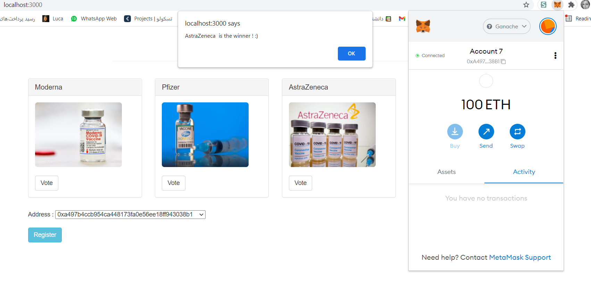
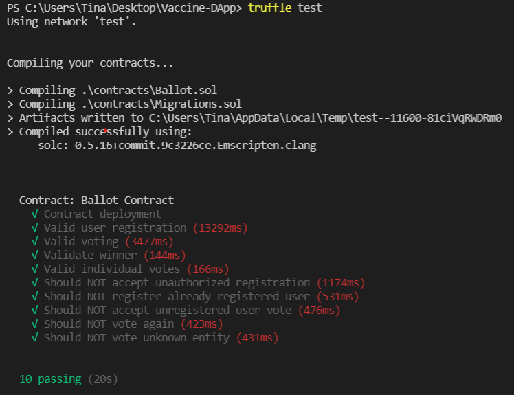

# Voting Vaccine DApp

Built a voting ballot application with 4 type of vaccine such that there is a chairperson who is authorized to register voters. Voters have the permission to vote only after the registration process.
=======
Built a voting ballot application with 4 type of vaccine that there is a chairperson who is authorized to register voters. Voters have the permission to vote only after the registration process.

<small> The smart contract used is based on the example in solidity docs </small>

## Business Logics handled
1. Chairperson registers accounts to vote to One type of vaccine
2. No other account can register accounts to vote
3. Can't register already registered user
4. Unregistered account can't vote
5. Registered accounts cannot vote twice
6. Can't vote a person who is not there

cause of deploy:

 

Voting:

Winning:

## Business logic to be included
1. State change rules
2. Save start time as a state variable

## Prerequisite
1. NodeJs
2. Metamask 
3. Truffle 

## Instruction for truffle testing
1. Clone the repository to a local folder
2. Go to the cloned folder using command line
3. Execute truffle compile
4. Open a new command line and execute truffle develop to start the blockchain network
5. In the old terminal execute truffle migrate --reset
6. Execute truffle test

This should print the following in the console

 Contract: BallotContract
    ✓ contract deployment
    ✓ valid users registration
    ✓ valid voting
    ✓ validate winner
    ✓ valid votes
    ✓ should NOT accept unauthorized registration
    ✓ should NOT register already registered user
    ✓ should NOT vote from unauthorized account
    ✓ should NOT vote twice
    ✓ should NOT vote unknown person

    10 passing

## Instruction for DApp

1. Now to start the nodeJs server execute npm run dev
2. This should start the front end of the application at localhost:3000
3. Open Metamask in your chrome browser and enter the key phrase you got after executing truffle develop
4. Now connect to private network using http://127.0.0.1:8545 and create as many accounts as you want
5. Now you should be in the first account in the metamask and register all other accounts
6. Now to cast vote from the account 2 change the account in Metamask from account 1 to account 2 and then click vote.
7. To vote from any account switch to that account in metamask and then click vote
8. Finally, after voting you can click declare winner

Note:
1. To deploy a new instance of the contract exit the npm server and then execute truffle migrate --reset and then start the server again.

2. The contract is deployed from account[0] i.e the first account in the metamask.
